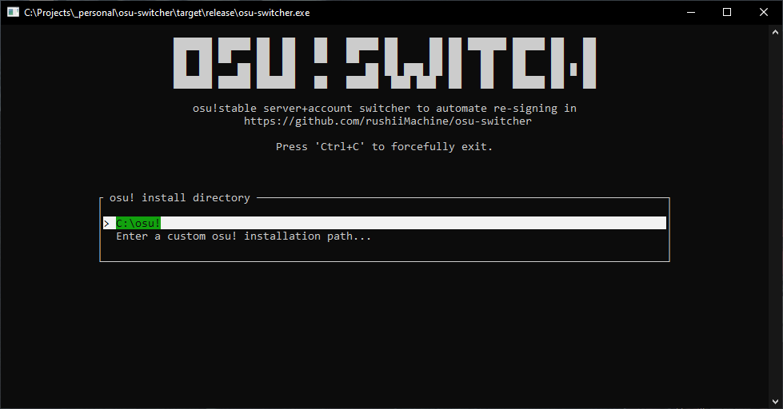
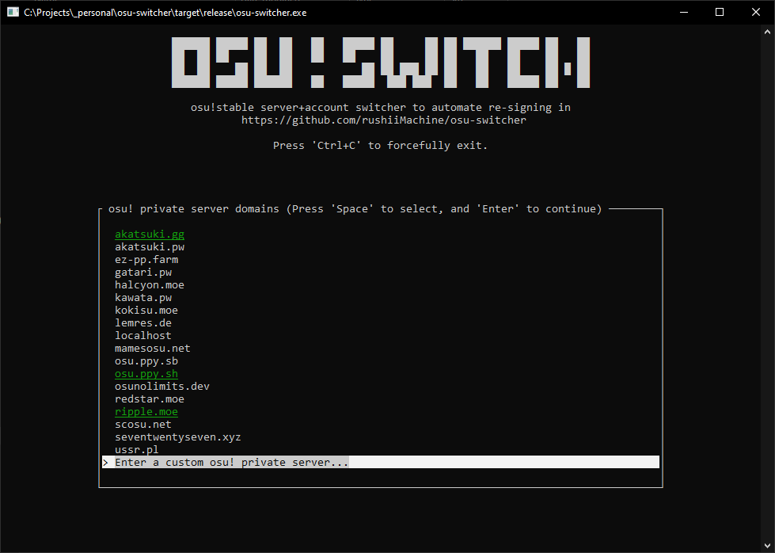
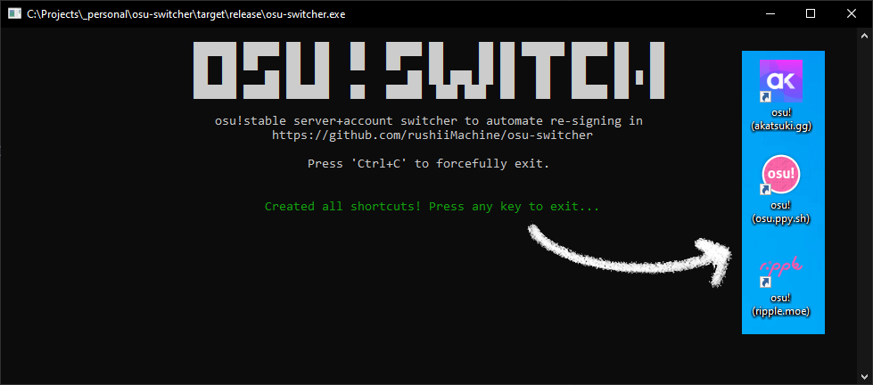

# osu!switcher

An osu!stable server + account switcher to automate signing in across different private servers.

## Usage

1. Download the [latest release](https://github.com/DiamondMiner88/osu-switcher/releases/latest) of osu!switcher
2. Open osu!switcher, and follow the instructions to select osu!'s installation path and private servers.
    - If Windows SmartScreen blocks it from starting, press "More info" → "Run anyway". I cannot afford $300/yr
      signing keys just to avoid this prompt.
3. Utilize the newly generated shortcuts on your desktop to launch osu!

    
    
    

### Additional Info

- osu!switcher persists itself to `%localappdata%/osu!switcher/` to ensure the shortcuts don't break
  if the executable gets deleted later.
- Due to an osu!stable bug outside my control, you may need to sign-in **twice** for new servers across two separate
  osu! launches before your credentials for the new server can be permanently saved.
- If you plan on moving osu!'s installation directory (eg. to a different drive),
  the shortcuts will have to be regenerated.

## How does it work?

#### The configuration files

osu! stores account details in two separate files:

- `$OSU_INSTALL_DIR/osu!.$SYSTEM_USERNAME.cfg`
- `$OSU_INSTALL_DIR/osu!.db`

The first one contains several keys responsible for storing authentication:

- `Username` -> Last attempted sign-in username
- `Password` -> Then current signed-in account's session key (possibly HWID-specific?)
- `CredentialEndpoint` -> The authentication server the session key was obtained from

The `osu!.db` binary database contains a field that records the same value as the `Username` field. This is
also necessary to swap, otherwise the session key will become invalidated.

This switcher stores all previous authentication details in a separate file: `$OSU_INSTALL_DIR/osu!switcher.ini`.

#### The switcher

When one of the generated shortcuts gets started, it does not directly start up osu!. Instead, the shortcut
launches the same osu!switcher binary with the selected "target server" option. The switcher will then proceed to:

1. Read the primary configuration file in osu!'s installation directory
2. If the last signed-in server matches the new target, skip to step #7
3. Store the current authentication details to the switcher's own configuration file for switching back to this server.
4. Find authentication details in the switcher's own configuration from a previous launch.
5. If auth details exist, then replace the authentication details in osu!'s main config file and database.
6. Delete previous logs & disable osu!'s force repair mechanism. (Read [below](#additional-details))
7. Restart osu!

#### Additional details

osu!'s anticheat writes encrypted logs to `$OSU_INSTALL_DIR/logs/osu!auth.log` when it runs, regardless of whether
the game is currently connected to Bancho (the official osu! server). I have heard rumors of people being banned
through the use of such logs on different accounts (which could be submitted upon next launch).
To prevent unnecessary risk in false-detection of multi accounting, these logs are wiped before every single
time osu! is started.

osu! has a "force repair" mechanism that launches the osu! in updater/installer mode, which will then proceed to
discard any `-devserver` flags, and connect to Bancho, which invalidates any authentication. This mechanism is
triggered when an empty file called `$OSU_INSTALL_DIR/.require_update` exists. To prevent this from happening,
when such a repair is detected, this switcher will prompt the user to decide whether to wipe it or continue with
the repair, before launching osu!.

## Disclaimer

**This is NOT a tool for multi-accounting.**

I often play on private servers often find it annoying to keep re-entering my login details.
This tool allows you to switch accounts *between* servers, not on the same server.
This tool does not attempt to spoof any device fingerprinting in order to bypass multi-account detection.
